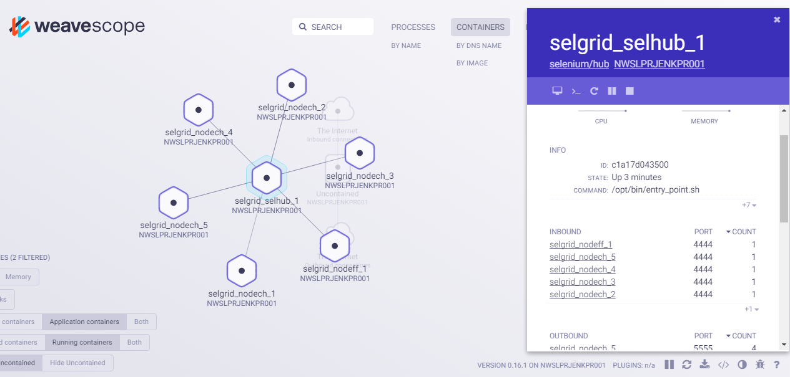

# Used to start a selenium grid with a chrome and ff, one of each

```
docker-compose up -d
```

This should start a selenium grid with hub listening on 4444, nodes are automatically registered to the hub.
Verify by hitting the url on http://docker-daemon-dns/ip:4444/grid/console

## Scale up or down

If you wish to increase the # of chrome browsers for example

```
docker-compose scale nodech=4 nodeff=3
```

This will scale the grid to have a total of 4 chrome instances and 3 firefox instances.

```
docker-compose scale nodech=1 nodeff=1
```
This will scale the grid to have a total of 1 ch and 1 ff instance (will stop if there are extra)


## View browser execution

The docker images used in this compose do NOT have vnc installed, because it gets very clunky and performance heavy.
That said if you still want to view the browsers, launch the docker-compose inside the "debug" folder. The images have vnc installed and exposed on 5900 (map the host port accordingly to access the GUI)

## Visualize using weave scope
cAdvisor from Google provides basic container and host monitoring visualization, however weave scope takes it to a new level  

```
sudo curl -L git.io/scope -o /usr/local/bin/scope
sudo chmod a+x /usr/local/bin/scope
scope launch
```  

Access on http://host|ip:4040  


